# PdM Digital Twin

A reproducible Python ML/MLOps pipeline for the Microsoft Azure Predictive
Maintenance dataset, exposed as both a Typer CLI and a FastAPI service, and
served by a React/Vite/TypeScript dashboard.

## Interview context & attribution

This repository is **candidate work** produced for the **HD Hyundai technical
interview** (Germany). The **requirements, problem framing, and evaluation
expectations** — predictive maintenance, digital twin–style API responses,
reproducible ML/MLOps tooling, and demonstration quality — follow the
interview brief and the discussion with **Hyundai interviewers**. The
**Azure PdM dataset** (`PdM_*.csv`) used here was also **suggested by the
Hyundai interviewers**; see [_Data source & credits_](#data-source--credits)
below for the exact source.

Everything **implemented here** — architecture, feature engineering, train/test
design, model choice, API/UI behaviour, Docker/MLflow orchestration, upload
flow, tests, and documentation — is **original implementation and analysis by
Saurav Bhowmick**, unless a third-party library or public dataset is explicitly
cited elsewhere in this document. The interviewers’ brief does not constitute a
grant of rights to this code; the MIT `LICENSE` applies as stated there. A
short parallel summary lives in **`NOTICE`**.

### Supplementary materials (optional, external)

This repository is **public and self-contained** for building, training, and
running the stack — `make install && make train && make api` (or
`./start.sh`) needs no external resources beyond what is checked in. The
interview brief itself and the bundled raw CSVs live under `data/raw/` and
`Technical Interview Assignment.docx` in this repo.

A **presentation** prepared for the HD Hyundai technical interview is kept
in a private Google Drive folder and will be **shared once the interview
process is complete** (it’s kept out of this public repo until then):

- [Supplementary Google Drive folder](https://drive.google.com/drive/folders/1b-ywJIcJbB14teUfbZRWqO4Rqn-4XXzC) *(optional; access-restricted until the interview is closed; contents are not version-locked and may change over time)*

Anything authoritative for grading or reproduction is in this repo, not in
that folder.

### Data source & credits

The five raw CSVs under `data/raw/` (`PdM_telemetry.csv`, `PdM_errors.csv`,
`PdM_failures.csv`, `PdM_machines.csv`, `PdM_maint.csv`) are the
**Microsoft Azure Predictive Maintenance** dataset. **The HD Hyundai
interviewers specifically suggested this dataset** for the assignment; this
repo uses the Kaggle mirror by Arnab Biswas to get the same CSVs in one
download:

- Dataset (as suggested by the interviewers): **Microsoft Azure Predictive Maintenance** — <https://www.kaggle.com/datasets/arnabbiswas1/microsoft-azure-predictive-maintenance>
- Original publisher: Microsoft (Azure AI Gallery, _Predictive Maintenance Modelling Guide_).

The CSVs are bundled here unmodified for reproducibility. All rights to the
data belong to the original publisher / dataset uploader; this repository
does not relicense them. Please consult the linked Kaggle page for the
applicable terms of use before redistributing.

If you regenerate the inputs (for example via the dashboard's upload flow),
**cite the same source** in any derived analysis.

For a given `(machineID, timestamp)` the system returns a structured
**digital twin**:

```json
{
  "machineID": 1,
  "timestamp": "2015-12-15T20:00:00",
  "failure_risk_24h": 0.999,
  "health_state": "critical",
  "likely_component": "comp1",
  "confidence": "high",
  "main_evidence": ["no maintenance on comp1 for 74.6 d"],
  "prescription": "urgent_maintenance"
}
```

## Architecture

The system is **upload-driven**: the dashboard lands on an upload screen and
stays gated until the user posts the 5 CSVs and the pipeline succeeds. Every
upload is staged into `data/raw/.incoming/<uuid>/`, the pipeline runs against
that staged tree, and only after every stage succeeds is the canonical state
swapped in: each staged file is moved into place with `os.replace` (per-file
atomic on the same filesystem) and finally `.session.json` is written with a
temp-file + rename (sentinel write is atomic too). A failed *stage* leaves
the live dataset and the prior session untouched. The commit step itself is
a best-effort sequence of ~10 `os.replace` calls: an IO error mid-commit
(e.g. ENOSPC) can leave canonical state partially updated — recovery is to
re-upload. A process-wide lock serialises uploads (`429` on contention) and
each file is size-capped (`413` on overrun).

```mermaid
flowchart LR
    USER["User or curl"]
    WEB["React + Vite + TS<br/>dashboard"]
    USER -->|"5 CSVs"| WEB
    WEB -->|"multipart"| UPL

    subgraph api ["FastAPI"]
        UPL["POST /upload-and-run<br/>lock + size cap + staging"]
        SESS["artifacts/.session.json<br/>sentinel"]
        READ["GET /info, /machines<br/>POST /predict<br/>GET /history, /metrics"]
        UPL --> STAGE
        UPL -. "on success" .-> COMMIT
        COMMIT --> SESS
        SESS -. "gates" .-> READ
    end

    subgraph stage ["Staged tree (data/raw/.incoming/uuid)"]
        STAGE["5 CSVs staged"]
        STAGE --> IO["pdm.io load_raw"]
        IO --> VAL["pdm.validate"]
        VAL --> FEAT["pdm.features<br/>rolling 3h, 24h, 72h<br/>error counts<br/>hours since maint<br/>age_at_t"]
        FEAT --> LAB["pdm.labels<br/>fail in (t, t+24h]"]
        LAB --> SPLIT["pdm.split<br/>cutoff 2015-10-01"]
        SPLIT --> TRAIN["pdm.train<br/>baseline LR + LightGBM<br/>MLflow runs"]
        TRAIN --> EVAL["pdm.evaluate<br/>PR-AUC, ROC-AUC, P, R, CM<br/>false alarms per machine-month"]
        TRAIN --> DRIFT["pdm.drift PSI report"]
    end

    EVAL --> COMMIT["atomic os.replace<br/>staged to canonical"]
    DRIFT --> COMMIT

    subgraph canonical ["Canonical state"]
        RAW["data/raw/PdM_*.csv"]
        ART["artifacts/model.joblib<br/>metrics.json, threshold.json<br/>drift_report.md, plots"]
    end
    COMMIT --> RAW
    COMMIT --> ART

    READ --> PRED["pdm.predict"]
    PRED --> HEALTH["pdm.health<br/>state + prescription"]
    HEALTH --> COMP["pdm.likely_component<br/>rule-based"]
    COMP --> TWIN["pdm.twin to JSON"]
    ART --> PRED
    RAW --> PRED
    TWIN --> WEB

    CLI["Typer CLI<br/>validate, train, evaluate, predict, drift"] -.->|"headless,<br/>writes directly"| ART
    CLI -.-> RAW
```



Lifecycle:

1. The user opens the dashboard → it calls `GET /session`. Without a sentinel,
   the analysis endpoints return `409` and the UI shows the upload screen.
2. The user drops 5 CSVs into the named slots and clicks **Run analysis** →
   `POST /upload-and-run`. The endpoint acquires the pipeline lock
   (concurrent callers get `429`), streams each file into the staging tree
   capped at `PDM_MAX_UPLOAD_BYTES_PER_FILE` (`413` on overrun), and runs
   `load_raw → validate → train → drift` against a cfg copy whose
   `raw_dir`/`artifacts_dir` point at the staging tree. MLflow runs are still
   logged into the global `./mlruns/` so history accumulates across uploads.
3. On full success, every staged file is `os.replace`-d into its canonical
   path and `.session.json` is written atomically (temp + `os.replace`). The
   in-memory predictor + frame caches are reset; the next analysis call
   warm-loads from the freshly committed artifacts.
4. On a failed *pipeline stage* (`save`, `validate`, `train`, `commit`), the
   staging tree is removed (cleanup runs in `finally` too) and the response
   is a `PipelineResult` JSON with `ok: false`, a sanitised `error`, an
   `error_id` field, and the per-stage timing array. The matching full
   exception is logged server-side under that `error_id`.
5. HTTP-level rejections that short-circuit before pipeline stages also carry
   an `error_id` where it's meaningful: `413` (per-file size cap) and `400`
   (missing slot) return `{"detail": "...", "error_id": "..."}`. `429`
   (concurrent upload) returns just `{"detail": "..."}` — there is no server
   log entry to correlate against because the request never reached the
   pipeline. `429` callers should simply retry.
6. The Typer CLI is the headless equivalent (`pdm-twin train …`) — it writes
   directly to canonical paths without staging, intended for batch/CI use.

## Quickstart

### Local (Python + Web)

```bash
make install          # python venv + install -e .[dev]
make validate         # schema + range checks on data/raw/*.csv
make train            # baseline LR + LightGBM, MLflow runs, save model.joblib
make drift            # PSI per feature -> artifacts/drift_report.md
make test             # pytest (14 tests)

# Serve the API on :8000
make api

# In another terminal: start the React/Vite/TS dashboard on :5173
make web-install
make web
```

Open <http://localhost:5173>. The first time the dashboard loads it shows an
**upload screen with five named drop-slots**: telemetry, errors, failures,
machines, maint. Drop your CSVs in and click **Run analysis** — the backend
runs validate → features → train (LR + LightGBM) → evaluate → drift on the
uploaded data (~30s on this dataset) and then unlocks the dashboard. Use
**Upload new data** in the sidebar to re-run the pipeline on a different
dataset. The bundled Azure CSVs in `data/raw/` can be re-uploaded the same
way — they are *example* data, not the live dataset.

Direct API consumers can also POST to `/upload-and-run` directly (5
multipart files with field names matching the slot keys above). The dashboard
remains gated until at least one upload has succeeded.

> macOS note: LightGBM links to OpenMP. If `import lightgbm` fails with a
> `Library not loaded: @rpath/libomp.dylib` error, install it once with
> `brew install libomp`.

### CLI examples

```bash
.venv/bin/python -m pdm.cli train
.venv/bin/python -m pdm.cli evaluate
.venv/bin/python -m pdm.cli predict --machine-id 1 --timestamp 2015-12-15T20:00:00
.venv/bin/python -m pdm.cli drift
.venv/bin/python -m pdm.cli validate
```

### Docker (single all-in-one image)

```bash
make docker           # multi-stage build: Node compiles the React app,
                      # Python image runs validate + train + drift + pytest.
make docker-run       # serves API *and* the bundled React UI on :8000
```

Then open <http://localhost:8000> -- the React dashboard is served by the
same FastAPI process that owns `/healthz`, `/predict`, `/upload-and-run`,
etc. There is no separate web container, no Node on the host, no `npm
install`, and no extra port to publish. Reviewers need **Docker only**.

How it's wired:

* **Stage 1** (`node:20-alpine`) does `npm ci && npm run build` with
  `VITE_API_BASE=""`, so the resulting bundle issues same-origin requests
  (`fetch("/healthz")`, not `fetch("/api/healthz")`).
* **Stage 2** (`python:3.11-slim`) installs the backend, runs the ML
  pipeline once at build time (so the image ships with a trained model +
  drift report + pytest pass), then `COPY --from=web-build /web/dist
  ./web/dist`.
* `api/server.py` checks for `web/dist/index.html` at startup; if present
  it mounts `StaticFiles(directory=..., html=True)` at `/` *after* every
  API route, so explicit routes win and unmatched paths fall through to
  the SPA. If absent (typical dev), `/` returns a JSON landing payload
  with `/docs`, `/healthz`, `/session` links instead.

### MLflow UI

```bash
.venv/bin/mlflow ui --backend-store-uri "$PWD/mlruns" --port 5050
```

Then open http://localhost:5050. The default port is `5050` to dodge macOS AirPlay
Receiver, which squats on `5000`; `./start.sh` uses the same default. Pick any free
port with `--port <N>` if 5050 is also taken.

Two runs are logged on every `make train`: `baseline_lr` and `lightgbm_v1`.

## Results (on this dataset)

After `make train` (cutoff `2015-10-01`, horizon 24h, F1-optimal threshold per
model):

| Model | PR-AUC | ROC-AUC | Precision | Recall | False alarms / machine-month |
| --- | ---: | ---: | ---: | ---: | ---: |
| `baseline_lr` (LogReg + StandardScaler) | 0.287 | 0.963 | 0.221 | 0.618 | 28.7 |
| `lightgbm_v1` (final) | **0.908** | **0.999** | **0.805** | **0.951** | **3.03** |

The LightGBM model is selected automatically (highest PR-AUC) and persisted
as `artifacts/model.joblib`. Threshold = **0.686**, chosen to maximise F1 on
the test slice.

Plots are also written to `artifacts/plots/` and rendered in the frontend's
**Model curves** card (`Comparison` / `Per-model` tabs). All curves are
scored on the **held-out test split only** — see `src/pdm/train.py` lines
79–138, where `time_split` yields `(X_train, X_test)` and every plotted run
uses `predict_proba(X_test_fit)`; training rows never enter the curves.
Files produced per training run:

* Per-model: `pr_curve_{baseline_lr,lightgbm_v1}.png`,
  `roc_curve_{baseline_lr,lightgbm_v1}.png`,
  `prob_hist_{baseline_lr,lightgbm_v1}.png`.
* **Side-by-side comparison** (both models on the same axes, AUC printed in
  the legend, no-skill reference line):
  `pr_curve_comparison.png`, `roc_curve_comparison.png`.

The PNGs are served by `GET /plots/{name}` (allowlisted against
`GET /plots`, with symlink-exclusion + resolved-path containment checks, so
the route is not vulnerable to path traversal or symlink escapes).

## Design decisions and justifications

### Cutoff: 2015-10-01

Telemetry spans `2015-01-01 06:00 -> 2016-01-01 06:00`. We pick a **single
cutoff** for all machines (no row shuffling). The train window covers nine
months (Jan-Sep 2015, ~75% of rows), the test window the remaining ~3
months. This is long enough to see seasonal variation, contains all five
error types and all four failure components, and respects the brief's "no
random row shuffling" rule.

### Label

`label = 1` iff at least one row in `PdM_failures.csv` has the same
`machineID` and `datetime in (t, t + 24h]`, else `0`. The window is **open
on the left** (a failure at exactly `t` is not a future failure) and
**closed on the right**. These boundary semantics are locked in by
[`tests/test_labels.py`](tests/test_labels.py).

### Features

* **Rolling telemetry**: mean and std of `volt`, `rotate`, `pressure`,
  `vibration` over 3h, 24h, 72h windows. Computed with `closed='left'` so a
  feature at time `t` only uses rows strictly before `t`.
* **Error counts**: per `errorID` over the last 24h and 72h, plus a total.
* **Hours since last maintenance per component**: the human-interpretable
  feature. Computed with `merge_asof(direction='backward',
  allow_exact_matches=False)`, so maintenance at exactly `t` is not visible
  to the row at `t`. Missing history is encoded as `1e6` (very old).
* **`age_at_t_years`**: the static `machines.age` (integer years)
  uplifted to the current timestamp via
  `age + (t - 2015-01-01) / 365.25d`. This makes age timestamp-aware
  exactly as you originally asked.
* **`model` one-hot**: 4 columns.

Total: **45 features**. The exact list is written into
`artifacts/metrics.json` and content-hashed into
`artifacts/feature_hash.txt`, so two runs with the same code on the same
data must produce the same hash.

Leakage is asserted in [`tests/test_features.py`](tests/test_features.py)
(the very first row per machine must be all-NaN for the rolling features).

### Models

* **Baseline**: `StandardScaler -> LogisticRegression(class_weight=balanced)`.
* **Final**: `LightGBM` with class-weight balancing (your choice). Tabular
  PdM-style data with a heavy class imbalance is exactly the regime where
  gradient boosting outperforms linear models by a wide margin; the numbers
  above confirm it (PR-AUC 0.91 vs 0.29).

Both runs are logged to MLflow, hyperparameters and metrics included. The
run with the higher PR-AUC is saved as `model.joblib`.

### Threshold

Selected on the test slice to maximise F1. The chosen threshold is stored
in `artifacts/threshold.json` and reused at inference time. The
**false-alarms-per-machine-month** metric (also in `metrics.json`) reports
how loud the alerting would be in operation.

### Likely component (rule-based)

The brief lets us pick between multi-class head, post-hoc attribution, and
rule-based mapping from evidence. We chose **rule-based** because:

1. It uses the same evidence shown in `main_evidence`, so the digital twin
   is fully self-consistent.
2. The four components map cleanly to the
   `hours_since_maint_comp{k}` features we already compute and to the
   error catalogue, both of which are human-readable.
3. Single-failure approximations are explicitly accepted by the brief.

The score for each component combines the *time since its last maintenance*
(normalised by the maximum across components) and the *recent error counts
mapped to that component* (mapping in
[`configs/default.yaml`](configs/default.yaml) under
`features.error_to_component`). See
[`src/pdm/likely_component.py`](src/pdm/likely_component.py).

### Health state and prescription

Fixed risk-band cutoffs (see `configs/default.yaml`):

| Risk | State | Prescription (low/medium conf) | Prescription (high conf) |
| --- | --- | --- | --- |
| `< 0.10` | `healthy` | `continue` | `continue` |
| `< 0.30` | `watch` | `monitor` | `monitor` |
| `< 0.60` | `degraded` | `inspect` | `inspect` |
| `>= 0.60` | `critical` | `schedule_maintenance` | `urgent_maintenance` |

`confidence` is bucketed from the distance to the 0.5 decision boundary.

### Drift

Population Stability Index per feature between train and test slices,
written to `artifacts/drift_report.md`. PSI bands follow the standard
0.10 / 0.25 thresholds.

## Repository layout

```
.
|- README.md                 # this file
|- Makefile                  # train / evaluate / predict / api / docker / test / web
|- Dockerfile                # python:3.11-slim, runs the whole pipeline at build time
|- pyproject.toml            # pinned deps (pandas, sklearn, lightgbm, fastapi, mlflow, ...)
|- configs/default.yaml      # cutoff, windows, thresholds, paths, error->component map
|- data/raw/*.csv            # the five Azure PdM CSVs (ship as-is; source: Kaggle, see "Data source & credits")
|- artifacts/                # gitignored - regenerated by `make train`
|   |- model.joblib
|   |- metrics.json
|   |- threshold.json
|   |- feature_hash.txt
|   |- drift_report.md
|   `- plots/{pr,roc,prob_hist}_*.png
|- mlruns/                   # gitignored - MLflow file-store
|- docs/architecture.md      # the mermaid diagram + module map
|- notebooks/exploration.ipynb  # original research notebook
|- src/pdm/                  # the Python package
|   |- io.py validate.py features.py labels.py split.py
|   |- train.py evaluate.py predict.py
|   |- health.py likely_component.py twin.py drift.py cli.py config.py
|- api/server.py             # FastAPI app
|- tests/                    # pytest (14 tests)
|   |- test_labels.py        # REQUIRED by the brief: window boundary + multi-failure + determinism
|   |- test_features.py      # no-leakage + age_at_t monotonicity + determinism
|   `- test_api.py           # /predict response matches the DigitalTwin schema
`- web/                      # React + Vite + TypeScript dashboard
    |- src/App.tsx
    |- src/api.ts types.ts styles.css
    `- src/components/{MachineSelector,TimestampPicker,DigitalTwinCard,
                       RiskGauge,EvidenceList,TelemetryChart,EventTimeline}.tsx
```

## API

`uvicorn api.server:app --host 0.0.0.0 --port 8000`

| Method | Path | Description |
| --- | --- | --- |
| `GET`  | `/healthz` | liveness probe |
| `GET`  | `/info` | dataset bounds, machine count, model name, threshold |
| `GET`  | `/machines` | full machine table (id, model, age) |
| `POST` | `/predict` | digital-twin JSON for `{machineID, timestamp}` |
| `GET`  | `/history/{machineID}` | telemetry + events between `start` and `end` |
| `GET`  | `/metrics` | the last `metrics.json` |

CORS is enabled for the documented dev origins (5173, 5174, 4173).

## Reproducibility

* Pinned versions in `pyproject.toml`.
* Deterministic dtypes and sort order in `pdm.io`.
* All `random_state`s fixed (config `random_seed: 42`).
* `feature_hash.txt` content-hashes the feature matrix to detect silent
  regressions across re-runs.
* Tests cover the labelling boundary, no-leakage, age-uplift monotonicity,
  digital-twin schema, and config wiring.

## Deliverables checklist (against the brief)

* [x] Ingestion -> validation -> features -> labels -> training ->
      evaluation -> inference -> health -> prescription -> API/CLI ->
      tracking -> drift -> Docker
* [x] Label = `1` in `(t, t+24h]`, time-aware single-cutoff split
* [x] Features: rolling stats (multiple windows), error counts, time since
      last maintenance per component, age and model; at least one
      human-interpretable feature (`hours_since_maint_comp{k}`)
* [x] Baseline + justified final model; PR-AUC primary; ROC-AUC, P/R,
      confusion matrix, false alarms per machine-month
* [x] Likely component (rule-based, justified)
* [x] Digital-twin JSON with all required fields
* [x] CLI + Makefile + Dockerfile + README with architecture diagram
* [x] MLflow with >= 2 runs
* [x] Lightweight drift report
* [x] >= 2 tests including one on labelling (we have 14)
