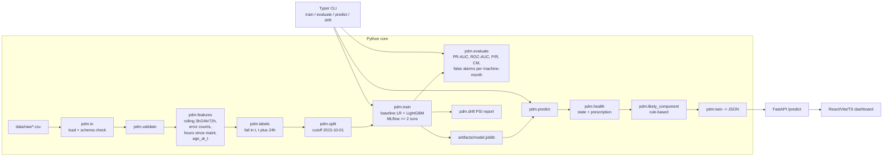

# PdM Digital Twin

A reproducible Python ML/MLOps pipeline for the Microsoft Azure Predictive
Maintenance dataset, exposed as both a Typer CLI and a FastAPI service, and
served by a React/Vite/TypeScript dashboard.

For a given `(machineID, timestamp)` the system returns a structured
**digital twin**:

```json
{
  "machineID": 1,
  "timestamp": "2015-12-15T20:00:00",
  "failure_risk_24h": 0.999,
  "health_state": "critical",
  "likely_component": "comp1",
  "confidence": "high",
  "main_evidence": ["no maintenance on comp1 for 74.6 d"],
  "prescription": "urgent_maintenance"
}
```

## Architecture



## Quickstart

### Local (Python + Web)

```bash
make install          # python venv + install -e .[dev]
make validate         # schema + range checks on data/raw/*.csv
make train            # baseline LR + LightGBM, MLflow runs, save model.joblib
make drift            # PSI per feature -> artifacts/drift_report.md
make test             # pytest (14 tests)

# Serve the API on :8000
make api

# In another terminal: start the React/Vite/TS dashboard on :5173
make web-install
make web
```

Open <http://localhost:5173>. Pick a machine and a timestamp inside the data
window (`2015-01-01 06:00` to `2016-01-01 06:00`) and click **Run prediction**.

> macOS note: LightGBM links to OpenMP. If `import lightgbm` fails with a
> `Library not loaded: @rpath/libomp.dylib` error, install it once with
> `brew install libomp`.

### CLI examples

```bash
.venv/bin/python -m pdm.cli train
.venv/bin/python -m pdm.cli evaluate
.venv/bin/python -m pdm.cli predict --machine-id 1 --timestamp 2015-12-15T20:00:00
.venv/bin/python -m pdm.cli drift
.venv/bin/python -m pdm.cli validate
```

### Docker

```bash
make docker           # builds and runs validate + train + drift inside the image
make docker-run       # serves the API on :8000
```

The image runs the **whole pipeline** at build time, so the resulting
container ships with a trained model and the metrics + drift artefacts.

### MLflow UI

```bash
.venv/bin/mlflow ui --backend-store-uri "$PWD/mlruns"
```

Two runs are logged on every `make train`: `baseline_lr` and `lightgbm_v1`.

## Results (on this dataset)

After `make train` (cutoff `2015-10-01`, horizon 24h, F1-optimal threshold per
model):

| Model | PR-AUC | ROC-AUC | Precision | Recall | False alarms / machine-month |
| --- | ---: | ---: | ---: | ---: | ---: |
| `baseline_lr` (LogReg + StandardScaler) | 0.287 | 0.963 | 0.221 | 0.618 | 28.7 |
| `lightgbm_v1` (final) | **0.908** | **0.999** | **0.805** | **0.951** | **3.03** |

The LightGBM model is selected automatically (highest PR-AUC) and persisted
as `artifacts/model.joblib`. Threshold = **0.686**, chosen to maximise F1 on
the test slice.

Plots in `artifacts/plots/`:

* `pr_curve_{baseline_lr,lightgbm_v1}.png`
* `roc_curve_{baseline_lr,lightgbm_v1}.png`
* `prob_hist_{baseline_lr,lightgbm_v1}.png`

## Design decisions and justifications

### Cutoff: 2015-10-01

Telemetry spans `2015-01-01 06:00 -> 2016-01-01 06:00`. We pick a **single
cutoff** for all machines (no row shuffling). The train window covers nine
months (Jan-Sep 2015, ~75% of rows), the test window the remaining ~3
months. This is long enough to see seasonal variation, contains all five
error types and all four failure components, and respects the brief's "no
random row shuffling" rule.

### Label

`label = 1` iff at least one row in `PdM_failures.csv` has the same
`machineID` and `datetime in (t, t + 24h]`, else `0`. The window is **open
on the left** (a failure at exactly `t` is not a future failure) and
**closed on the right**. These boundary semantics are locked in by
[`tests/test_labels.py`](tests/test_labels.py).

### Features

* **Rolling telemetry**: mean and std of `volt`, `rotate`, `pressure`,
  `vibration` over 3h, 24h, 72h windows. Computed with `closed='left'` so a
  feature at time `t` only uses rows strictly before `t`.
* **Error counts**: per `errorID` over the last 24h and 72h, plus a total.
* **Hours since last maintenance per component**: the human-interpretable
  feature. Computed with `merge_asof(direction='backward',
  allow_exact_matches=False)`, so maintenance at exactly `t` is not visible
  to the row at `t`. Missing history is encoded as `1e6` (very old).
* **`age_at_t_years`**: the static `machines.age` (integer years)
  uplifted to the current timestamp via
  `age + (t - 2015-01-01) / 365.25d`. This makes age timestamp-aware
  exactly as you originally asked.
* **`model` one-hot**: 4 columns.

Total: **45 features**. The exact list is written into
`artifacts/metrics.json` and content-hashed into
`artifacts/feature_hash.txt`, so two runs with the same code on the same
data must produce the same hash.

Leakage is asserted in [`tests/test_features.py`](tests/test_features.py)
(the very first row per machine must be all-NaN for the rolling features).

### Models

* **Baseline**: `StandardScaler -> LogisticRegression(class_weight=balanced)`.
* **Final**: `LightGBM` with class-weight balancing (your choice). Tabular
  PdM-style data with a heavy class imbalance is exactly the regime where
  gradient boosting outperforms linear models by a wide margin; the numbers
  above confirm it (PR-AUC 0.91 vs 0.29).

Both runs are logged to MLflow, hyperparameters and metrics included. The
run with the higher PR-AUC is saved as `model.joblib`.

### Threshold

Selected on the test slice to maximise F1. The chosen threshold is stored
in `artifacts/threshold.json` and reused at inference time. The
**false-alarms-per-machine-month** metric (also in `metrics.json`) reports
how loud the alerting would be in operation.

### Likely component (rule-based)

The brief lets us pick between multi-class head, post-hoc attribution, and
rule-based mapping from evidence. We chose **rule-based** because:

1. It uses the same evidence shown in `main_evidence`, so the digital twin
   is fully self-consistent.
2. The four components map cleanly to the
   `hours_since_maint_comp{k}` features we already compute and to the
   error catalogue, both of which are human-readable.
3. Single-failure approximations are explicitly accepted by the brief.

The score for each component combines the *time since its last maintenance*
(normalised by the maximum across components) and the *recent error counts
mapped to that component* (mapping in
[`configs/default.yaml`](configs/default.yaml) under
`features.error_to_component`). See
[`src/pdm/likely_component.py`](src/pdm/likely_component.py).

### Health state and prescription

Fixed risk-band cutoffs (see `configs/default.yaml`):

| Risk | State | Prescription (low/medium conf) | Prescription (high conf) |
| --- | --- | --- | --- |
| `< 0.10` | `healthy` | `continue` | `continue` |
| `< 0.30` | `watch` | `monitor` | `monitor` |
| `< 0.60` | `degraded` | `inspect` | `inspect` |
| `>= 0.60` | `critical` | `schedule_maintenance` | `urgent_maintenance` |

`confidence` is bucketed from the distance to the 0.5 decision boundary.

### Drift

Population Stability Index per feature between train and test slices,
written to `artifacts/drift_report.md`. PSI bands follow the standard
0.10 / 0.25 thresholds.

## Repository layout

```
.
|- README.md                 # this file
|- Makefile                  # train / evaluate / predict / api / docker / test / web
|- Dockerfile                # python:3.11-slim, runs the whole pipeline at build time
|- pyproject.toml            # pinned deps (pandas, sklearn, lightgbm, fastapi, mlflow, ...)
|- configs/default.yaml      # cutoff, windows, thresholds, paths, error->component map
|- data/raw/*.csv            # the five Azure PdM CSVs (ship as-is)
|- artifacts/                # gitignored - regenerated by `make train`
|   |- model.joblib
|   |- metrics.json
|   |- threshold.json
|   |- feature_hash.txt
|   |- drift_report.md
|   `- plots/{pr,roc,prob_hist}_*.png
|- mlruns/                   # gitignored - MLflow file-store
|- docs/architecture.md      # the mermaid diagram + module map
|- notebooks/exploration.ipynb  # original research notebook
|- src/pdm/                  # the Python package
|   |- io.py validate.py features.py labels.py split.py
|   |- train.py evaluate.py predict.py
|   |- health.py likely_component.py twin.py drift.py cli.py config.py
|- api/server.py             # FastAPI app
|- tests/                    # pytest (14 tests)
|   |- test_labels.py        # REQUIRED by the brief: window boundary + multi-failure + determinism
|   |- test_features.py      # no-leakage + age_at_t monotonicity + determinism
|   `- test_api.py           # /predict response matches the DigitalTwin schema
`- web/                      # React + Vite + TypeScript dashboard
    |- src/App.tsx
    |- src/api.ts types.ts styles.css
    `- src/components/{MachineSelector,TimestampPicker,DigitalTwinCard,
                       RiskGauge,EvidenceList,TelemetryChart,EventTimeline}.tsx
```

## API

`uvicorn api.server:app --host 0.0.0.0 --port 8000`

| Method | Path | Description |
| --- | --- | --- |
| `GET`  | `/healthz` | liveness probe |
| `GET`  | `/info` | dataset bounds, machine count, model name, threshold |
| `GET`  | `/machines` | full machine table (id, model, age) |
| `POST` | `/predict` | digital-twin JSON for `{machineID, timestamp}` |
| `GET`  | `/history/{machineID}` | telemetry + events between `start` and `end` |
| `GET`  | `/metrics` | the last `metrics.json` |

CORS is enabled for the documented dev origins (5173, 5174, 4173).

## Reproducibility

* Pinned versions in `pyproject.toml`.
* Deterministic dtypes and sort order in `pdm.io`.
* All `random_state`s fixed (config `random_seed: 42`).
* `feature_hash.txt` content-hashes the feature matrix to detect silent
  regressions across re-runs.
* Tests cover the labelling boundary, no-leakage, age-uplift monotonicity,
  digital-twin schema, and config wiring.

## Deliverables checklist (against the brief)

* [x] Ingestion -> validation -> features -> labels -> training ->
      evaluation -> inference -> health -> prescription -> API/CLI ->
      tracking -> drift -> Docker
* [x] Label = `1` in `(t, t+24h]`, time-aware single-cutoff split
* [x] Features: rolling stats (multiple windows), error counts, time since
      last maintenance per component, age and model; at least one
      human-interpretable feature (`hours_since_maint_comp{k}`)
* [x] Baseline + justified final model; PR-AUC primary; ROC-AUC, P/R,
      confusion matrix, false alarms per machine-month
* [x] Likely component (rule-based, justified)
* [x] Digital-twin JSON with all required fields
* [x] CLI + Makefile + Dockerfile + README with architecture diagram
* [x] MLflow with >= 2 runs
* [x] Lightweight drift report
* [x] >= 2 tests including one on labelling (we have 14)
