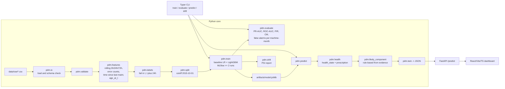

# Architecture



## Pipeline stages

| Stage | Module | Output |
| --- | --- | --- |
| Ingestion | [`src/pdm/io.py`](../src/pdm/io.py) | five typed DataFrames |
| Validation | [`src/pdm/validate.py`](../src/pdm/validate.py) | schema + range checks |
| Feature engineering | [`src/pdm/features.py`](../src/pdm/features.py) | one-row-per `(datetime, machineID)` |
| Labelling | [`src/pdm/labels.py`](../src/pdm/labels.py) | binary `label` in `(t, t+24h]` |
| Split | [`src/pdm/split.py`](../src/pdm/split.py) | time-aware single-cutoff split |
| Training | [`src/pdm/train.py`](../src/pdm/train.py) | `artifacts/model.joblib`, MLflow runs |
| Evaluation | [`src/pdm/evaluate.py`](../src/pdm/evaluate.py) | `artifacts/metrics.json`, plots |
| Drift | [`src/pdm/drift.py`](../src/pdm/drift.py) | `artifacts/drift_report.md` |
| Health + prescription | [`src/pdm/health.py`](../src/pdm/health.py) | `health_state`, `prescription` |
| Likely component | [`src/pdm/likely_component.py`](../src/pdm/likely_component.py) | `comp1..comp4` |
| Digital twin | [`src/pdm/twin.py`](../src/pdm/twin.py) | Pydantic `DigitalTwin` JSON |
| API | [`api/server.py`](../api/server.py) | FastAPI endpoints |
| CLI | [`src/pdm/cli.py`](../src/pdm/cli.py) | `train / evaluate / predict / drift / validate` |

## Data contracts

`DigitalTwin` schema returned by `POST /predict`:

```json
{
  "machineID": 1,
  "timestamp": "2015-12-15T20:00:00",
  "failure_risk_24h": 0.999,
  "health_state": "critical",
  "likely_component": "comp1",
  "confidence": "high",
  "main_evidence": ["no maintenance on comp1 for 74.6 d"],
  "prescription": "urgent_maintenance"
}
```

Mirrored verbatim in [`web/src/types.ts`](../web/src/types.ts).
